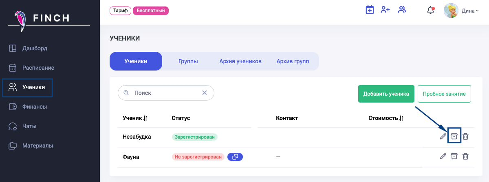
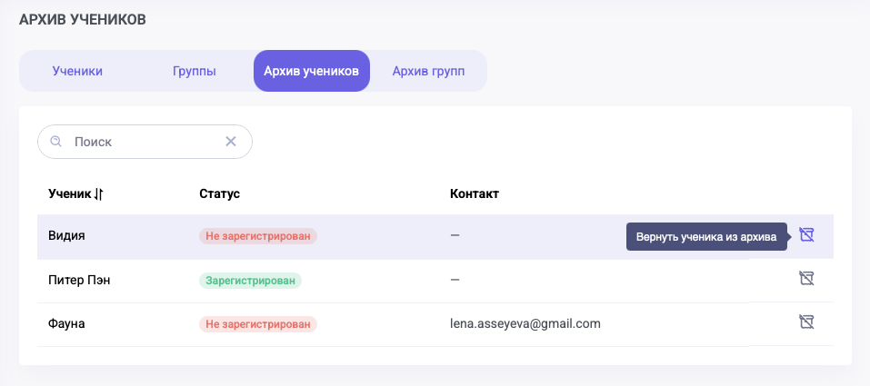

Изменился путь переноса ученика в архив. Теперь это можно сделать со страницы учеников по кнопке «Перенести в архив».

{width=1200px height=449px}

После нажатия на кнопку, всплывет сообщение с подтверждением данного действия.

{width=341px height=278px}

Перенесенные в архив ученики отображаются на вкладке «Архив учеников». По соответствующей кнопке  можно вернуть ученика обратно в общий список.

{width=957px height=425px}

27\.08.2026