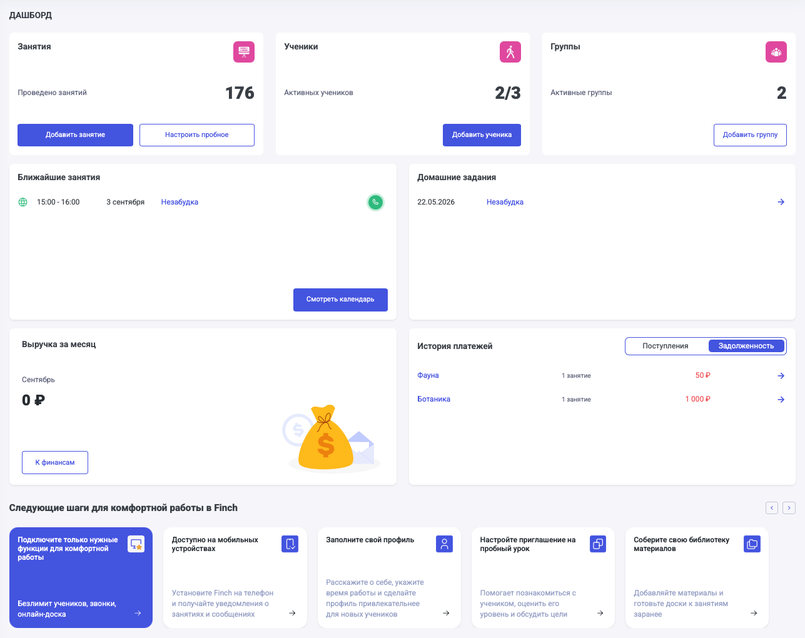

Опубликовали много изменений по отображению дашборда, чтобы сделать его максимально наглядным и удобным в использовании.

1\. При открытии страницы Дашборд у пользователя в самом верху отображаются:

-  Ученики

-  Занятия

-  Группы

2\. Стали доступны виджеты с ближайшими занятиями, а также с заданиями на проверку.

3\. После добавления хотя бы одного ученика появляются виджеты:

-  Выручка за месяц

-  История платежей

4\. Внизу страницы расположился блок с удобными шагами по знакомству с платформой.

{width=1287px height=1020px}

03\.06.2026