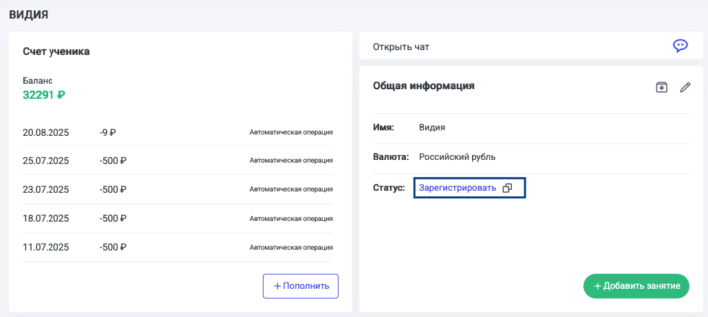

Нельзя стартовать урок с незарегистрированным учеником, также незарегистрированный ученик не будет видеть материалы и занятия. 

Для регистрации ученика необходимо передать ему ссылку для регистрации. Скопировать ее можно, нажав на кнопку «Зарегистрировать», например, из карточки ученика. 

{width=1029px height=462px}

Или при добавлении ученика из расписания: Добавить занятие -->Ввести имя ученика -->Добавить--> Скопировать ссылку на регистрацию.

Рядом с именем ученика в списке учеников отображается статус «Зарегистрирован» или «Не зарегистрирован» с возможностью скопировать ссылку на регистрацию. 