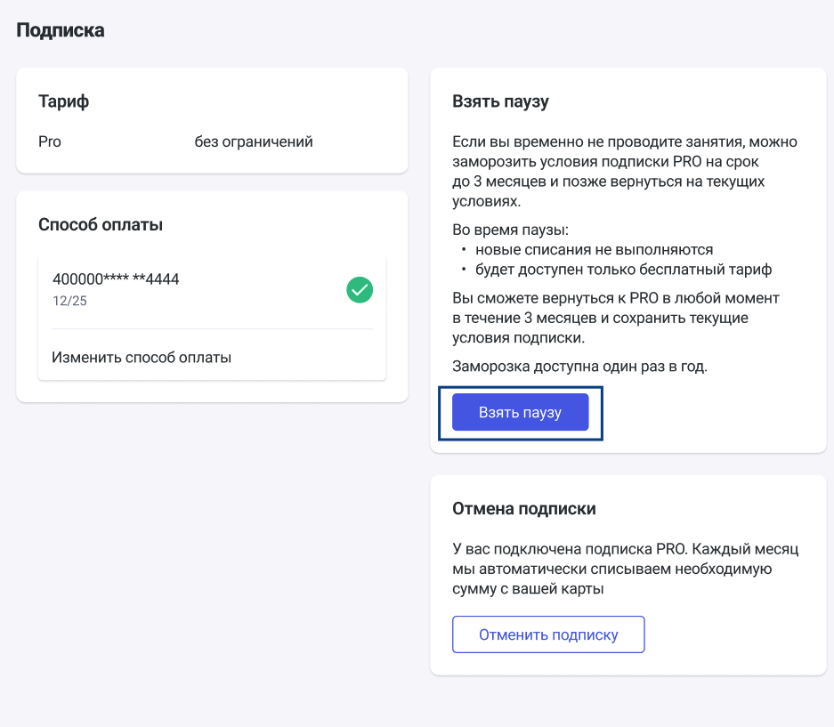

Для пользователей с действующей подпиской PRO появилась возможность взять паузу на условиях: не больше 1 раза за календарный год (с 1 января текущего года по 31 декабря текущего года, с 1 января следующего года появится возможность снова взять одну паузу в год) и сроком не более, чем на 3 месяца. Вернуться можно и раньше, чем через 3 месяца, но разбить этот срок на несколько периодов нельзя. Условия PRO будут действовать до оплаченной даты, с первого дня неоплаченного периода будет включена пауза. После завершения паузы пользователь возвращается на те же условия тарифа PRO при своевременной оплате.

На период паузы пользователь находится на бесплатном доступе, а именно: ученики сверх 3 уходят в архив, нет доступа к звонкам и доскам.

Взять паузу можно из раздела «Подписка» по кнопке «Взять паузу». Там же описаны и все условия.

{width=937px height=817px}

13\.07.2026