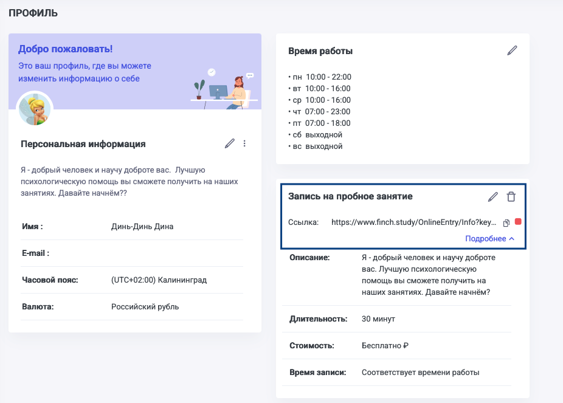

У преподавателя есть три варианта добавить ученика:

-  через создание карточки ученика в разделе «Ученики»

-  через создание урока в разделе «Расписание»

-  через пробный урок -- *тут ученик регистрируется самостоятельно*

Добавление ученика через пробный урок доступно внутри Профиля преподавателя.

{width=926px height=663px}

При записи на пробное занятие для ученика и преподавателя действуют следующие правила:

-  Через ссылку ученик может записаться только на одно пробное занятие

-  Следующие уроки с учеником преподаватель самостоятельно добавляет в расписание

-  Таким способом можно пригласить не более 3-х учеников на бесплатном тарифе, если таких учеников предвидится больше, то необходимо оплатить безлимит

-  Если не настроить отдельное расписание для пробного урока, то ученик увидит все слоты базового расписания

08\.07.2026