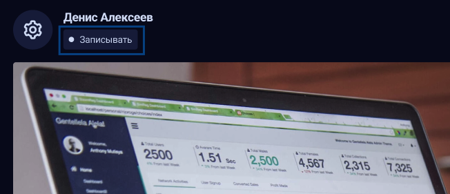
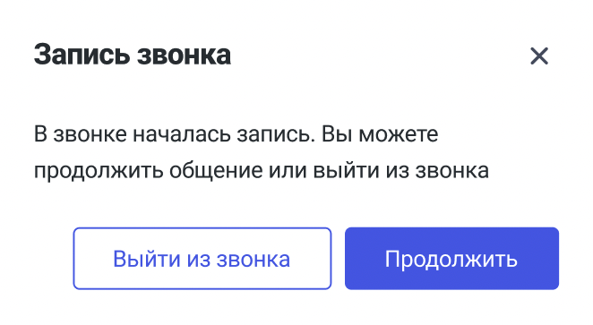
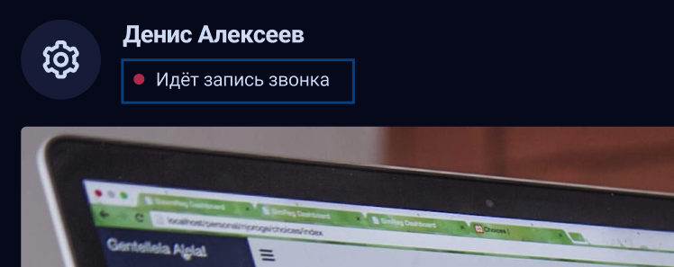
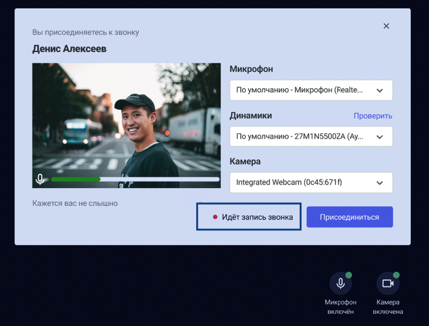
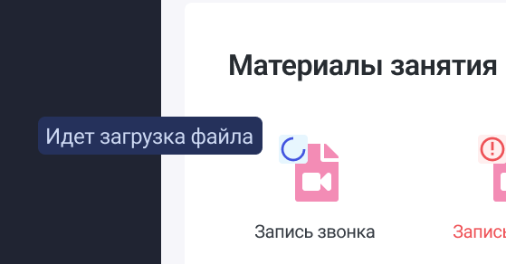
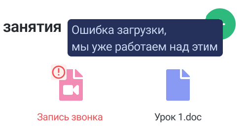

Реализован функционал записи звонков.

Для этого в звонок добавлена кнопка для старта записи звонка, она доступна только репетиторам.

{width=652px height=281px}

После того, как началась запись иконка записи у репетитора сменится на “Остановить запись”, а у прочих участников звонка появится информационное окно о том, что ведется запись.

{width=662px height=363px}

Нажатие на крестик означает ровно то же самое, что и продолжить = пользователь соглашается и остается в.

У учеников в звонке иконка записи выглядит следующим образом:

{width=748px height=297px}

Если ученик подключается в звонок к моменту, когда уже идет запись, то в предбаннике высветится:

{width=700px height=532px}

Сама запись звонка по ее завершению и перекодированию автоматически подгружается в материалы занятия.

В момент, когда запись видео перекодируется, перенос времени и даты занятия не доступны. При наведении на эти элементы показывается тултип: “Нельзя перенести занятие, так как осуществляется перекодирование и загрузка записи занятия. Пожалуйста, дождитесь завершения. После завершения перекодирования и прикрепления записи в материалы занятия, снова разрешено изменение даты и времени.

Если запись еще не перекодированна, то отображается со спиннером, при наведении/нажатии на файл показывается тултип «Идет загрузка файла».

{width=559px height=292px}

Если произошла ошибка при перекодировании файла, то отображается соответствующая иконка, при наведении/нажатии на файл показывается тултип «Ошибка загрузки, мы уже работаем над этим».

{width=501px height=283px}

### Важные уточнения

Если в звонке нет никого >=5 минут, то запись выключается автоматически.

Если по времени занятие закончилось, а запись всё еще идет, и в звонке есть участники, то через 10 минут после планируемого времени окончания занятия показывается подсказка репетитору с предложением запись завершить. Если нажатия на кнопку продления звонка не происходит, то по истечении 2-х минут запись автоматически отключается. Если нажатие происходит, то подсказка будет показываться каждые полчаса (если запись еще идет).

14\.04.2026