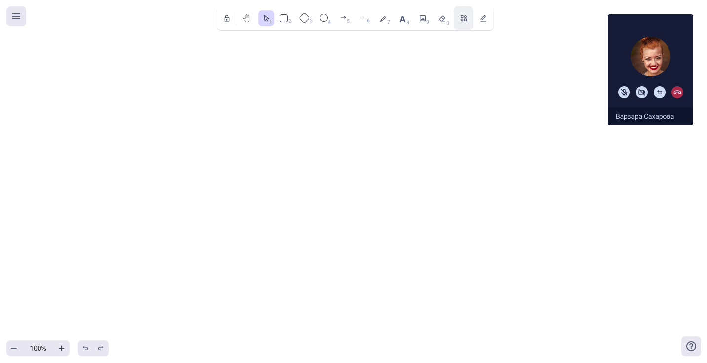

Для удобства пользователей реализовали возможность открывать доску прямо в звонке.

Блок с собеседником крепится в углу. При групповом звонке показывается активный говорящий. В окне с собеседником доступны кнопки: микрофон, камера, кнопка возврата обратно в звонок (тогда доска закрывается у пользователя), кнопка завершения звонка.

В версии для мобильного видепоток выводиться не будет, но станет доступна кнопка "Вернуться в звонок", которая сворачивается в компактную через 5 секунд после входа на доску.

.png>)

17\.06.2025