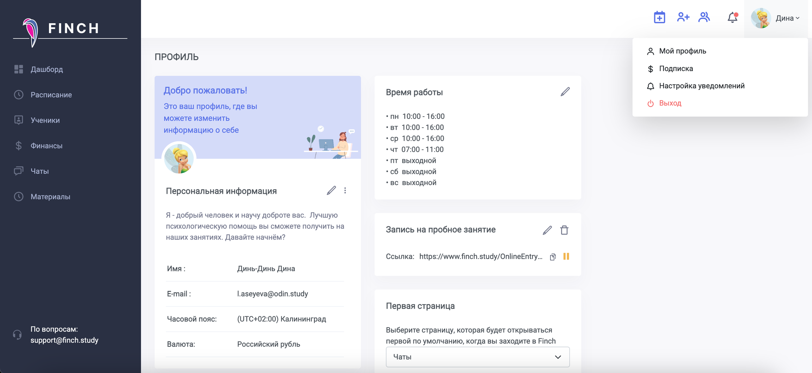
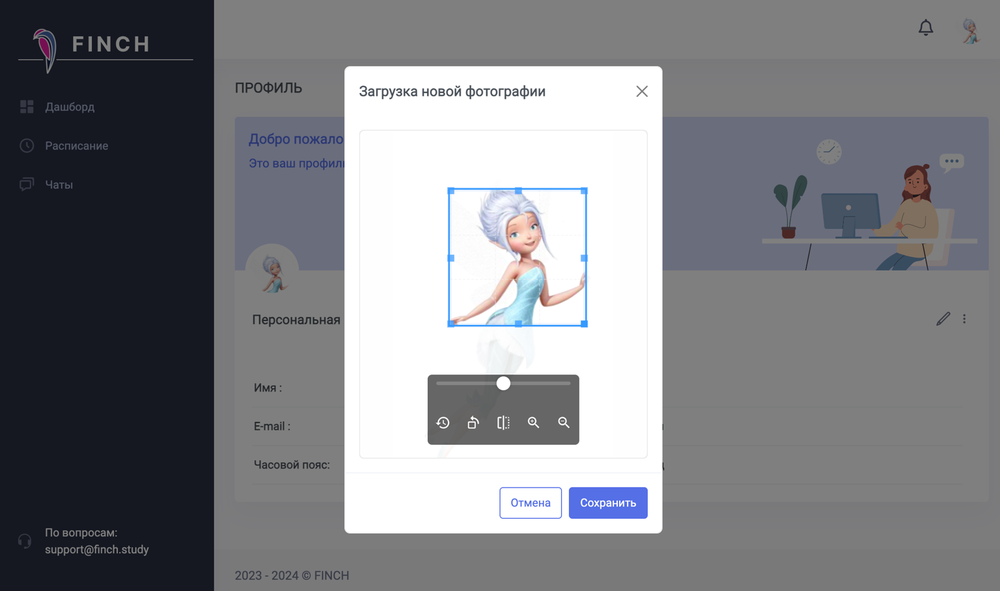

[tabs]

[tab:Репетитор]

{width=2304px height=1058px}

На странице профиля репетитор может:

-  заполнить режим работы (в соответсвии с режимом работы будет доступна запись на пробные занятия и [добавление занятий](./../zanyatiya-i-videozvonki/dobavlenie-zanyatii) с учениками)

-  добавить своё фото (видно при записи на [пробное занятие](./ssylka-zapis-na-probnoe) и в ЛК ученика)

-  написать персональную информацию (раздел "О себе" виден при записи на [пробное занятие](./ssylka-zapis-na-probnoe) в ЛК ученика)

-  установить стартовую страницу при входе в Finch

[/tab]

[tab:Ученик]

{width=1536px height=909px}

В своём профиле ученик может заполнить:

-  Имя

-  E-mail

-  Часовой пояс в UTC+02:00, чтобы занятия в расписании отображались по времени ученика.

[/tab]

[/tabs]