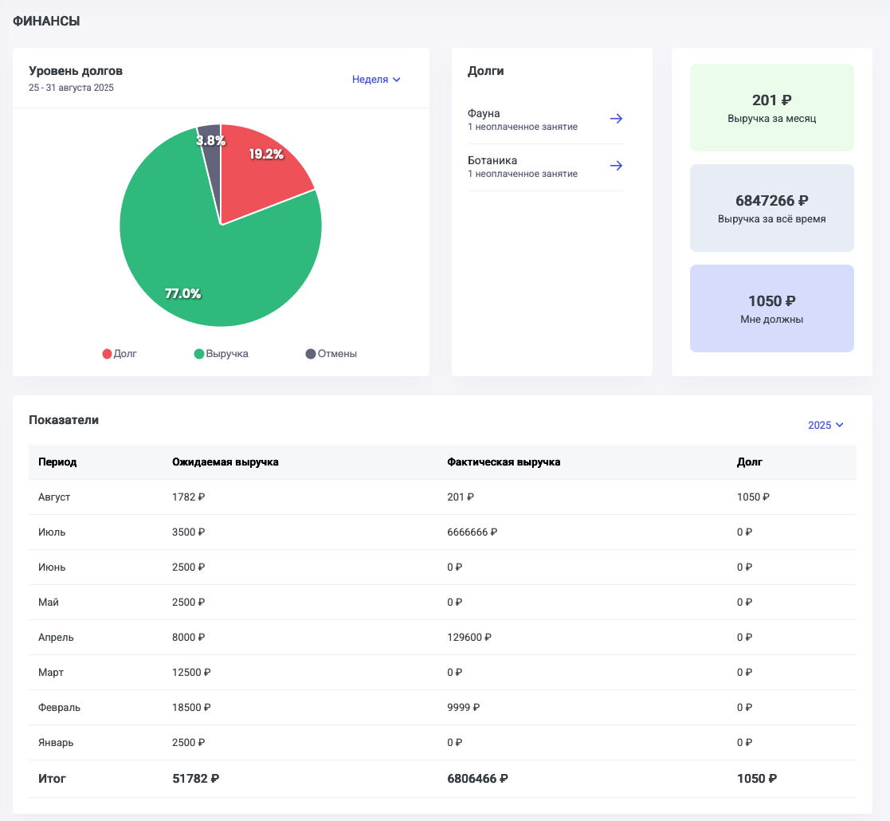

На  странице Финансы блоками отображена информация:

-  уровень выручки/долгов - графическая диаграмма, где можно наглядно посмотреть процент выручки и неоплаченных занятий в разрезе недели, месяца, года или за всё время.

-  список учеников, кто имеет неоплаченные занятия с возможностью перехода к странице ученика.

-  финансовые показатели с ожидаемой и фактической выручкой по месяцам и за всё время.

{width=1117px height=1030px}

Как высчитываются показатели:

Долг - Суммарная стоимость занятий со статусом оплаты “Долг“ за выбранный период.

Выручка - Суммарная стоимость занятий со статусом оплаты “Оплачено“ + остаток на балансе за выбранный период.

Отмены - Суммарная стоимость занятий со статусом “Отменено“ за выбранный период.

Ниже диаграммы есть таблица с показателями, которые отображаются помесячно с начала текущего года. 

Ожидаемая выручка - Суммарная стоимость занятий (во всех статусах, включая отменённые и будущие)

Фактическая выручка - Суммарная стоимость занятий со статусом оплаты “Оплачено“ и оплаченной части занятия со статусом «Частично оплачено».

Долг - Суммарная стоимость занятий со статусом оплаты “Долг“ и неоплаченной части занятия со статусом «Частично оплачено».