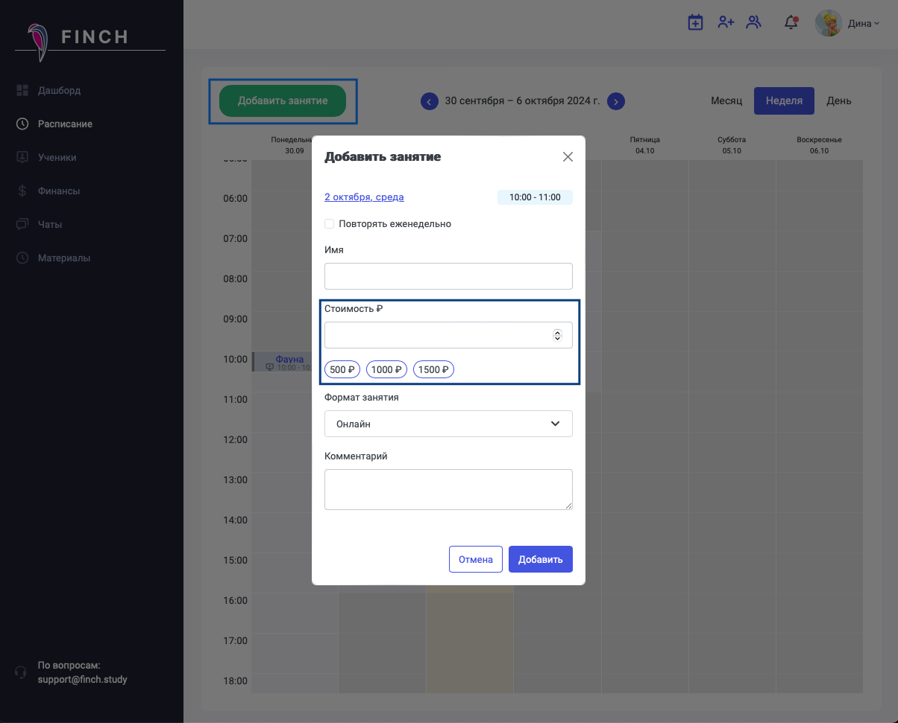
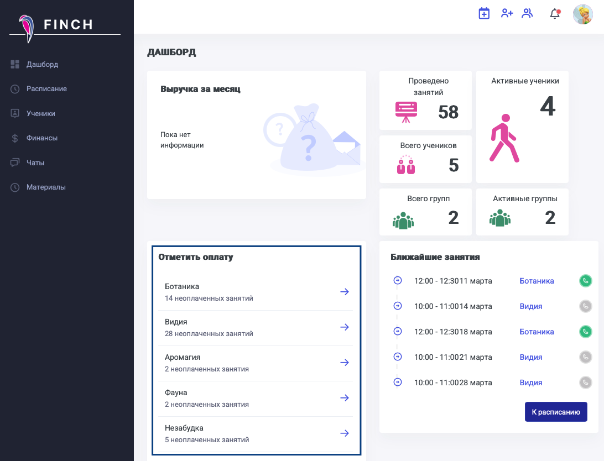
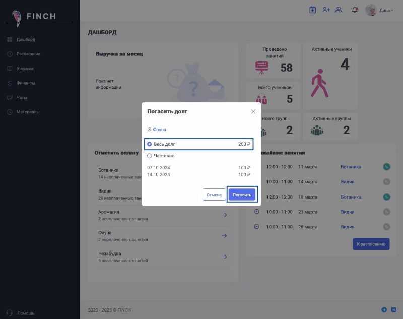
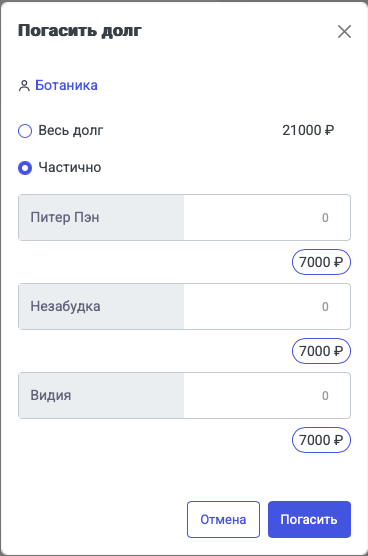
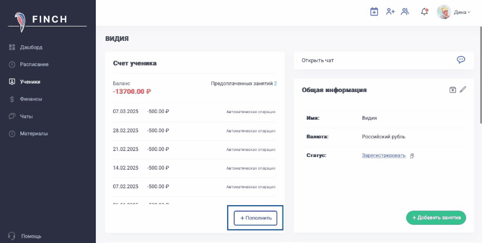
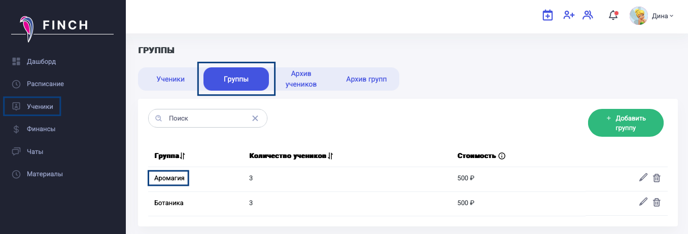
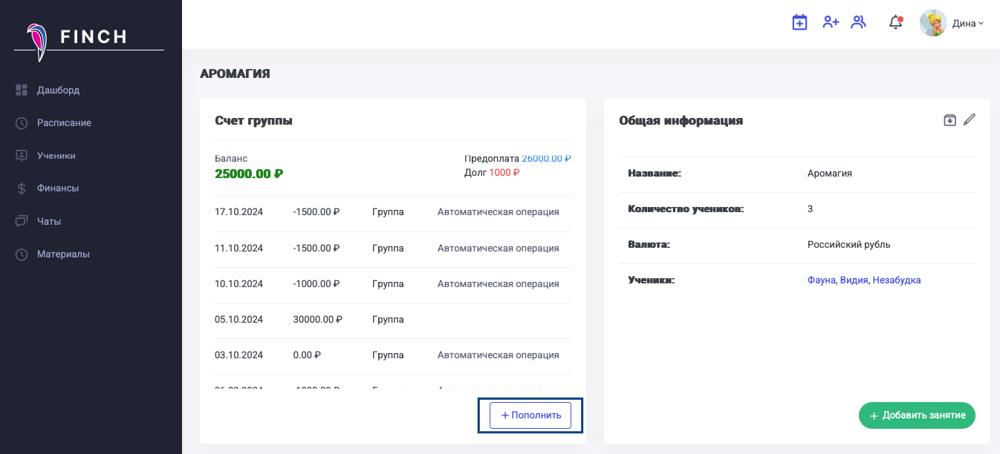
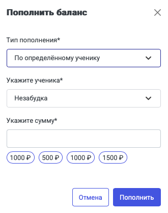
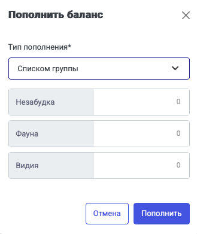
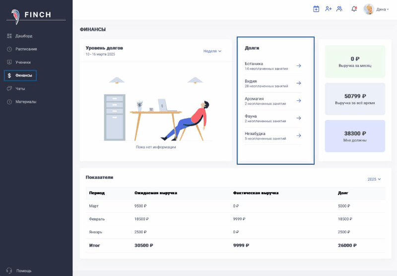

### **Выставление стоимости**

Сделать это можно при добавлении занятия из "Расписания". Для этого надо нажать "Добавить занятие". И далее в соответствующем поле указать сумму вручную или выбрать из предложенных вариантов.

{width=1204px height=971px}

Чтобы поменять стоимость занятия, надо со страницы расписания выбрать необходимое занятие, кликнуть по нему, нажать "Редактировать" (если занятие повторяющееся, то надо указать, редактируется только данное занятие или все последующие тоже) и изменить сумму.

{width=433px height=280px}

### **Отметка оплаты/пополнения счета**

Отметить оплату можно несколькими способами.

[tabs]

[tab:Дашборд]

Из блока "Отметить оплату".

{width=1092px height=834px}

Далее надо выбрать одного из учеников/одну группу и указать, погашен ли долг полностью или частично.

{width=800px height=633px}

В случае, если отметка идет по группе, то можно сразу отметить полную оплату (если все ученики внесли суммы).

{width=364px height=371px}

Либо внести суммы частично по каждому ученику.

{width=368px height=556px}

[/tab]

[tab:Страница ученика]

Со страницы "Ученики" выбираем одного из учеников, кому надо отметить оплату. Такой функционал используется для пополнении баланса ученика при предоплате за занятия.

В блоке "Счет ученика" можно пополнить баланс на оплаченную сумму.

{width=800px height=404px}

Аналогично можно выбрать группу и проставить оплату по ней.

{width=1356px height=462px}

После клика на название группы откроется страница группы, где можно проставить оплаты по группе.

{width=1346px height=612px}

Можно выставить оплату по определенному ученику, выбрав его из выпадающего списка.

{width=330px height=418px}

Либо по списку учеников этой группы отметить каждому внесенную сумму по отдельности.

{width=329px height=391px}

[/tab]

[tab:Финансы]

Со страницы "Финансы" в блоке "Долги" можно выбрать ученика/группу и выставить по ним полную/частичную оплату аналогично, как со страницы "Дашборд".

{width=800px height=556px}

[/tab]

[/tabs]