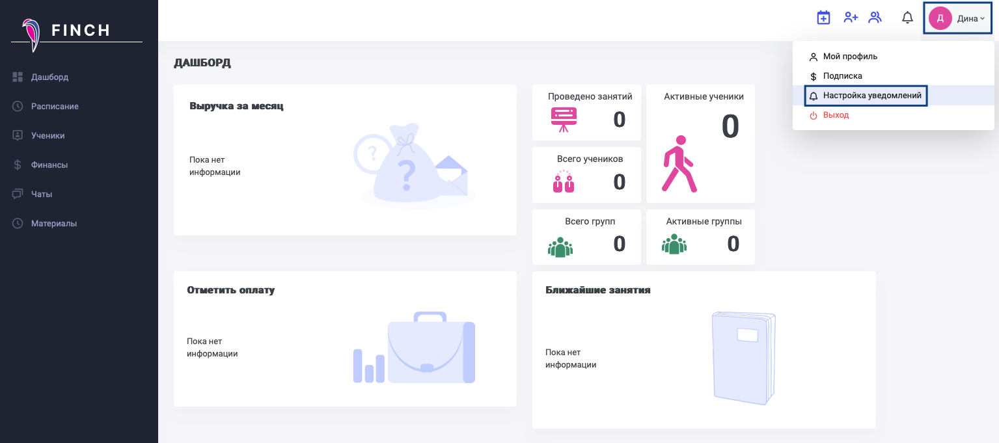
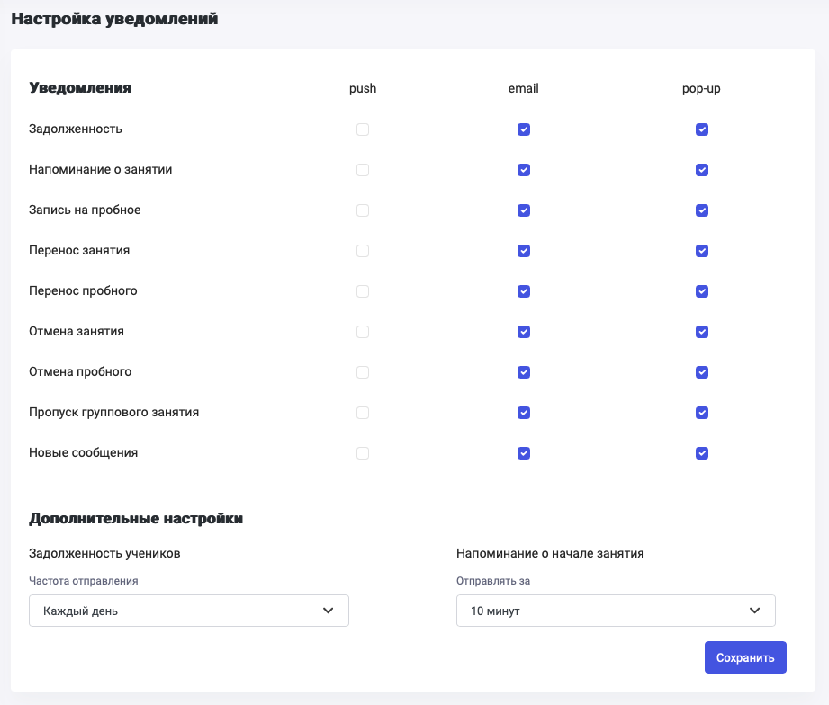
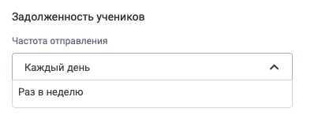
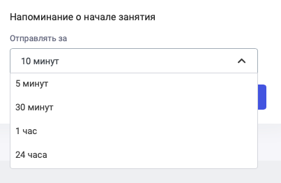
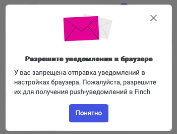

Для настройки уведомлений необходимо нажать на иконку имени и выбрать "Настройка уведомлений".

{width=1535px height=681px}

Откроется страничка со списком уведомлений, которые могут приходить в системе (задолженность, напоминание о занятии, запись на пробное, перенос занятия, отмена занятия, отмена пробного, пропуск группового занятия, новые сообщения). Можно включить/отключить получение любого из этих уведомлений по каналам push/e-mail/pop-up, для этого надо установить или снять галку напротив каждого уведомления и типа его получения.

{width=921px height=784px}

Также можно настроить уведомления по информированию о задолженности учеников по частоте.

{width=403px height=156px}

И установить срок, за который надо будет напомнить о занятии.

{width=403px height=262px}

Если в браузере не включены всплывающие уведомления Push, то система предложит их включить. Настройка зависит от браузера.

{width=351px height=265px}