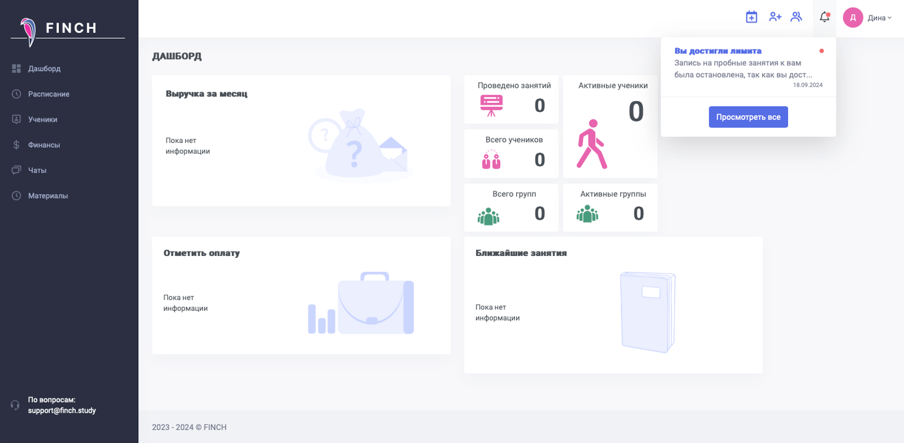
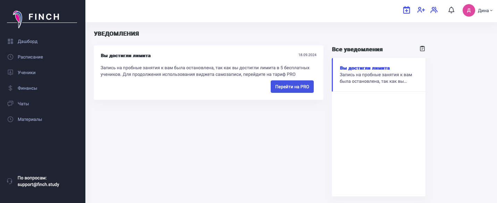
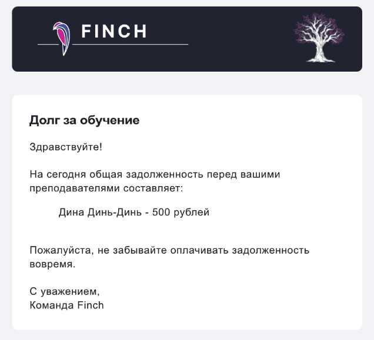

Все полученные уведомления можно прочитать, кликнув на колокольчик в правом верхнем углу экрана. Если есть непрочитанные уведомления, то возле колокольчика будет гореть красная иконка.

{width=1536px height=753px}

После перехода по кнопке "Посмотреть всё" откроется страничка с полученными уведомлениями.

{width=1432px height=586px}

При наличии долга ученик получит уведомление в системе с текстом: "У вас имеется задолженность в размере \*сумма\* рублей за занятия с \*репетитор\*. Не забудьте, пожалуйста, ее погасить". Напоминание отправляется раз в сутки, пока ученик не погасит долг или не отключит получение таких уведомлений в настройках своего личного кабинета.

{width=470px height=415px}

И также ученик получит подобное предупреждение на почту.

{width=636px height=579px}