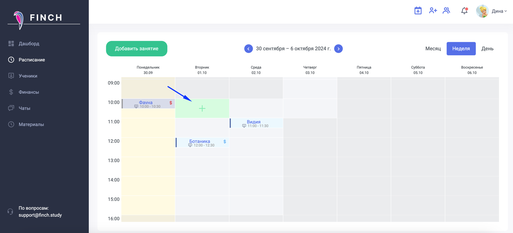
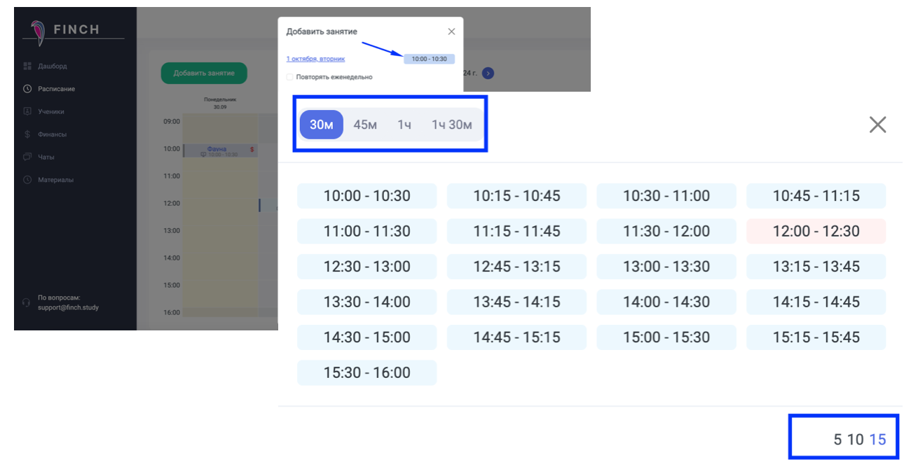
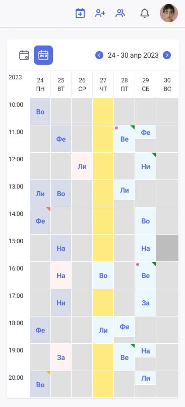
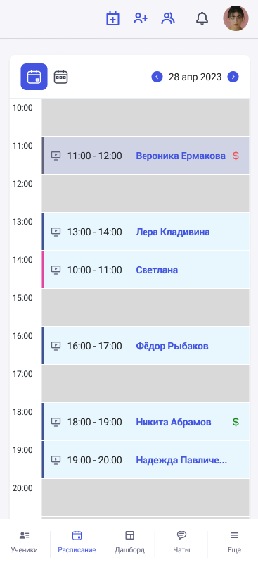
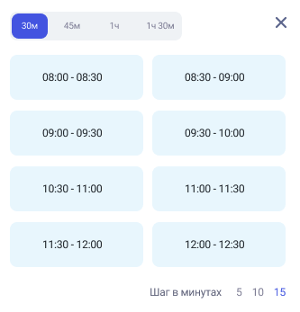

В соответсвии с расписанием в клетке таблице при наведении появится "+" = добавить занятие.

{width=1536px height=698px}

:::note 

При добавлении занятия необходимо выставить его продолжительность и шаг по времени между занятиями.

:::

{width=1300px height=680px}

Также добавление занятий доступно в мобильной версии:

-  мобильный календарь на неделю

{width=367px height=805px}

-  мобильный календарь на день

-  {width=367px height=805px}

Выбор времени выглядит следующим образом:

{width=333px height=347px}