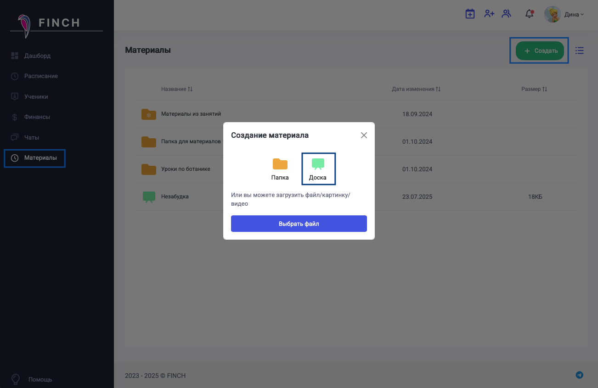

Создайте доску.

{width=1302px height=845px}

Назовите доску понятным именем, например, как зовут ученика или темой занятия и сохраните.

{width=331px height=253px}

Заполните доску необходимой информацией  (по желанию).

{width=1299px height=845px}

Перетащите материалы в занятие ученика/группы.

Преподаватель в звонке откроет материалы занятия и затем выберет подготовленную доску, а ученик, кликнув на доску, сможет сразу перейти к нужной.

Откройте новую доску, чтобы она появилась в списке для выбора у ученика. Для вас на новой вкладке откроется интерактивная доска.

Ученик увидит доску в списке и откроет её.

Работая на доске, преподаватель может добавлять различные элементы, в том числе интерактивные, ученик видит информацию и может также писать ответы.

Для повышения удобства пользователей установлены дефолтные настройки для доски (т.е. те, которые будут включены при открытии/создании новой доски), а именно:

-  Толщина штриха - тонкая

-  Стиль обводки - сплошная

-  Стиль обводки - архитектор

Если пользователь установил свои настройки, то система их запомнит на будущее.

Замок в панели является активным (чтобы можно было подряд создавать несколько одинаковых элементов).