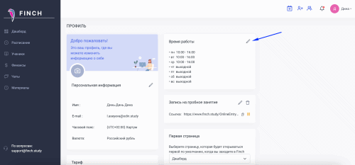

# Расписание

## Заполнение расписания

При первом входе будет предложено настроить расписание - время, по которому будете проводить занятия и валюту, в которой будет отмечаться оплата клиентов. &#x20;

<figure><figcaption></figcaption></figure>

Далее расписание будет доступно из пункта меню. Можно настроить режим отображения на месяц/неделю/день.

<figure><figcaption></figcaption></figure>

Изменить/отредактировать режим работы можно на странице профиля.

<figure><figcaption></figcaption></figure>

<figure><figcaption></figcaption></figure>

Добавить занятие следует по кнопке "Добавить занятие". Редактировать занятие можно из самого расписания, кликнув на занятие, которое надо отредактировать.&#x20;

<figure><figcaption></figcaption></figure>

